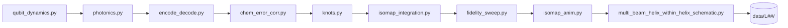

# Vortex Quaternion Conduit (VQC) — OAM Simulations

Ultra-high-density quantum data compression and transfer via OAM-flux qubits and quaternion encoding.

[](https://github.com/kinaar8340/vqc_sims_public)

**Public release:** Phase 1.2.93 (Nov 27, 2025) — **COMPLETE**  
**Orchestrator:** `run_all.py` v1.2.91 Ω  
**Patent:** US provisional 63/913,110 (filed Oct 28, 2025) · Amendments Nov 15, Nov 26, Nov 27, 2025

---

## Overview

VQC simulates a full photonic–quantum pipeline that encodes classical data into quaternion representations, propagates orbital angular momentum (OAM) modes through nested helical beams, and recovers them with overcomplete ICA demixing under 16-qubit quantum error correction (QEC).

| Capability | Detail |
|---|---|
| QEC mode | 16-qubit canonical (8- and 4-qubit modes deprecated) |
| OAM horizon | `L_max = 199` validated; `L_inner ≤ 1999` stability cap |
| Channels | `2 × L_max + 1` orthogonal OAM modes + quaternion layer |
| Default config | `configs/params.yaml` · `QEC_LEVEL=16` set by orchestrator |

Pre-generated simulation archives under `data/L199/` are not included in this repository (withheld for patent enablement). All pipeline code is present — run locally to reproduce figures, CSVs, and PDFs.

---

## Quick Start

### 1. Install

```bash
git clone https://github.com/kinaar8340/vqc_sims_public.git
cd vqc_sims_public
python3 -m venv .venv && source .venv/bin/activate
# Shared Quaternion core (with vqc_proto / flux_hopf_lib ecosystem)
pip install -e ../../flux_hopf_lib   # if cloned under Projects/ as sibling
# or: pip install "flux-hopf-lib==0.2.1"
pip install -r requirements.txt
```

**Requirements:** Python 3.10+ · [flux-hopf-lib](https://github.com/kinaar8340/flux_hopf_lib) · tested on a 72-core PowerEdge R630; scales down on consumer hardware with reduced `L_max`.

### Ecosystem

| Repo | Role |
|------|------|
| [flux_hopf_lib](https://github.com/kinaar8340/flux_hopf_lib) | Shared Quaternion / Hopf / flux core (`src/quaternion_core.py` re-exports) |
| [vqc_proto](https://github.com/kinaar8340/vqc_proto) | Orbital Braille typehead + HF Space demos |
| [hfb](https://github.com/kinaar8340/hfb) | Hopf flux bubble / analog gravity |

This public Phase-1 stack remains the **parent OAM simulation suite**; demos live in `vqc_proto`.

### 2. Run the full pipeline

```bash
# Recommended: respects params.yaml, parallel Isomap, auto-archives to data/L199/
OMP_NUM_THREADS=16 python run_all.py

# Override OAM horizon via environment (propagates to all pipeline stages)
VQC_L_MAX_OVERRIDE=199 OMP_NUM_THREADS=16 python run_all.py

# Extended sims at L_inner=1999 (expect ~4–6 h on 72-core hardware)
VQC_L_MAX_OVERRIDE=1999 OMP_NUM_THREADS=16 python run_all.py
```

`run_all.py` executes every stage in order, archives transient `outputs/` to `data/L{final_l}/`, and prints a summary banner on completion.

**Runtime estimates (72-core node):**

| `L_max` | Approx. time |
|---|---|
| 199 | 1–2 hours |
| 1999 | 4–6 hours |

### 3. Run tests

```bash
pytest -q
```

### 4. Explore results (optional)

```bash
streamlit run analysis/dashboard.py
```

The dashboard auto-detects the highest `data/L##/` archive and renders figures, tables, GIFs, and PDF summaries.

---

## Pipeline



| Stage | Module | Role |
|---|---|---|
| Qubit dynamics | `src/qubit_dynamics.py` | Single- and multi-mode OAM-flux Lindblad evolution under 16-qubit QEC |
| Photonics | `src/photonics.py` | Vectorized helical-beam propagation with nested shielding |
| Encode / decode | `src/encode_decode.py` | Quaternion encoding, BMGL / p-wave gating, ICA demixing, diagnostic plots |
| Chemical QEC | `src/chem_error_corr.py` | Chemical error correction with p-wave altermagnetic boosts (γ₁ = 1.5) |
| Topology | `src/knots.py` | Stevedore 8₃ knot protection |
| Manifold embed | `src/isomap_integration.py` | Isomap embeddings with batch stress reporting |
| Fidelity sweep | `analysis/fidelity_sweep.py` | Infidelity sweep (floored at 1e⁻¹⁸ for visualization) |
| Animation | `analysis/isomap_anim.py` | 3D Isomap evolution GIFs |
| Schematic | `src/multi_beam_helix_within_helix_schematic.py` | Multi-beam "helix-within-a-helix" schematics |

**Supporting modules:** `src/demixing.py` (ICA recovery) · `analysis/dashboard.py` (Streamlit viewer) · `analysis/roemmele_proxy_viz.py` (interactive HTML proxy)

**Outputs** land in `outputs/` during a run, then archive to `data/L{final_l}/` with CSVs, PNG figures, GIFs, and PDFs.

---

## Configuration

### `configs/params.yaml`

Single source of truth for simulation parameters. Key fields:

```yaml
qubit_multi:
  L_max: 199          # OAM horizon (primary knob)
photonics:
  lambda_nm: 1550.0   # Wavelength
  N: 512              # Grid resolution
demix:
  n_components: 8
  n_samples: 12000
```

### `L_max` resolution order

Each module resolves the effective OAM horizon as:

1. `VQC_L_MAX_OVERRIDE` environment variable (set automatically by `run_all.py`)
2. `--L_max` / `--l_max` CLI flag (per-script)
3. `configs/params.yaml` → `qubit_multi.L_max`
4. Built-in default (25)

`run_all.py` sets `final_l = max(199, highest_existing_data/L##/)` and exports it as `VQC_L_MAX_OVERRIDE`.

### Environment variables

| Variable | Default | Purpose |
|---|---|---|
| `QEC_LEVEL` | `16` | QEC width (set by orchestrator) |
| `VQC_QEC_16QUBIT` | `true` | Enable 16-qubit suppression |
| `VQC_L_MAX_OVERRIDE` | from orchestrator | OAM horizon override |
| `OMP_NUM_THREADS` | system default | OpenMP thread count for NumPy/SciPy |

---

## Achieved Metrics (Phase 1.2.93, representative)

Locally generated reference values at `L_max = 199`:

| Metric | Value |
|---|---|
| Global gate fidelity | 0.9992 (multi-beam, L_outer = 3, L_inner = 1999) |
| Chemical QEC fidelity | 0.9999912711 (α ≈ 0.001751) |
| Topological protection | Stevedore 8₃ knot — fidelity 1.000000 |
| Isomap stress | 0.0133 (3D embedding, k = 20; batch mean across 5 embeddings) |
| Demixing post-FID | > 99.92% (overcomplete ICA; intensity / phase offsets 0.110 / −0.002) |
| Quaternion compression | Up to 4.6875 × 10⁹ (scales with ℓ; example: q(0.590 + 0.402i + 0.628j + 0.309k)) |
| Infidelity sweep floor | ≤ 4.046 × 10⁻¹¹ (enforced at 1e⁻¹⁸ for plots) |
| Batch yield | 100% · pytest suite passing |

**New in 1.2.93:** p-wave altermagnetic BMGL boosts (γ₁ = 1.5), NUMA-optimized multiprocessing in Isomap stages, and updates to `encode_decode.py`, `photonics.py`, and `chem_error_corr.py`. Yields 33–50% error-suppression boosts and extended T₂ coherence > 222 μs.

---

## Project Structure

```
vqc_sims_public/
├── run_all.py              # Master orchestrator
├── configs/
│   └── params.yaml         # Canonical parameters
├── src/
│   ├── qubit_dynamics.py
│   ├── photonics.py
│   ├── encode_decode.py
│   ├── chem_error_corr.py
│   ├── knots.py
│   ├── demixing.py
│   ├── isomap_integration.py
│   └── multi_beam_helix_within_helix_schematic.py
├── analysis/
│   ├── fidelity_sweep.py
│   ├── isomap_anim.py
│   ├── dashboard.py
│   └── roemmele_proxy_viz.py
├── tests/                  # pytest suite
├── outputs/                # Transient run artifacts (gitignored)
└── data/                   # Archived results data/L##/ (gitignored)
```

---

## Running Individual Stages

```bash
# Standalone chemical QEC with CSV export
python src/chem_error_corr.py --L_max 199

# Fidelity sweep with CSV output
python analysis/fidelity_sweep.py --save_csv

# Isomap animation (60 frames)
python analysis/isomap_anim.py --n_frames 60

# Multi-beam schematic at extended inner OAM
python src/multi_beam_helix_within_helix_schematic.py --L_inner 1999
```

---

## Patent Alignment

| Amendment | Summary |
|---|---|
| **Nov 27** | Validated `L_max = 199` simulations with p-wave BMGL boosts (γ₁ = 1.5) and 16-qubit QEC across all modules. Mean gate fidelity 0.9992, chemical QEC 0.9999912711, knot fidelity 1.000000, Isomap stress 0.0133. Multi-beam architectures (L_inner = 1999) maintain > 99.92% end-to-end fidelity. |
| **Nov 26** | p-wave helical magnets for BMGL; atomic-scale spin helices with switchable orientation. Dynamic gating via SOC (λ = 0.4) and p-wave splitting (p = 1.2), inhibiting errors up to 8.88× at γ₁ = 1.5. |
| **Nov 15** | OAM-DWDM + Isomap guards claimed. |

**BMGL protocol:** OAM rotation (30–45°/ns for |ℓ| ≥ 5) tied to gating:

```
ω_ℓ(t) = ℓ × chirp_rate + detune_scale × α     (α = 0.03–0.035)
```

Patent drawings include fluxonium vaults and OAM modulation cross-sections (`vqc_drawing_sheets.pdf` when generated locally).

---

## Dependencies

See [`requirements.txt`](requirements.txt). Core packages:

| Package | Role |
|---|---|
| NumPy, SciPy, pandas | Numerics and tabular I/O |
| Matplotlib, Plotly, Pillow, imageio | Figures and animations |
| scikit-learn | Isomap, FastICA demixing |
| QuTiP, PySCF | Quantum and chemistry backends |
| Joblib | Parallel Isomap batch processing |
| numpy-quaternion | Quaternion arithmetic |
| ReportLab | PDF generation |
| Streamlit | Interactive dashboard |
| pytest | Test suite |

---

## License & Contact

Released under **CC-BY-NC-SA-4.0** with additional patent restrictions. You may view, fork, and modify for **non-commercial research** with attribution. Commercial use, sublicensing, or deployment requires written license from the patent holder.

**Contact:** [kinaar0@protonmail.com](mailto:kinaar0@protonmail.com)

Contributions welcome for non-commercial research use. See [`LICENSE`](LICENSE) for full terms.
