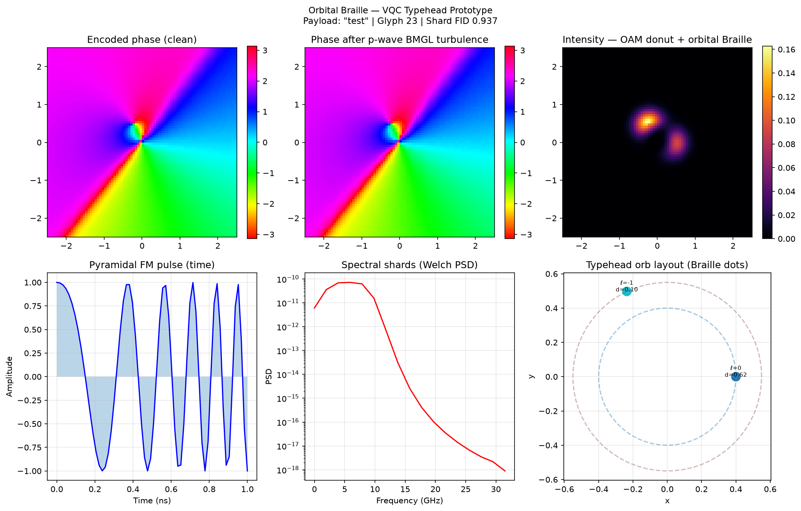

# Orbital Braille — VQC Typehead Prototype

Standalone layout of the code in [`kinaar8340/vqc_proto`](https://github.com/kinaar8340/vqc_proto) (`proto/` subdirectory on GitHub). Full docs: [proto/README.md on GitHub](https://github.com/kinaar8340/vqc_proto/blob/main/proto/README.md).

## Latest validated demo (4 orbs)

```bash
.venv/bin/python run_demo.py --payload "I live in Oregon" --num-orbs 4
```

| Metric | Value |
|--------|-------|
| Fisher-Rao separation | **0.989 rad** |
| Shard fidelity | **0.929** |
| Glyph match | index 2, fidelity **0.868** |



## Quick start

```bash
python3 -m venv .venv && .venv/bin/pip install -r requirements.txt
.venv/bin/python run_demo.py --payload "I live in Oregon" --num-orbs 4
.venv/bin/python sweep_orbs.py
.venv/bin/python generate_slm_holograms.py --device generic_512
```

## SLM virtual typehead

Hardware-ready phase holograms — no mechanical rotation. See **[SLM_QUICKSTART.md](SLM_QUICKSTART.md)**.

**Repo:** https://github.com/kinaar8340/vqc_proto